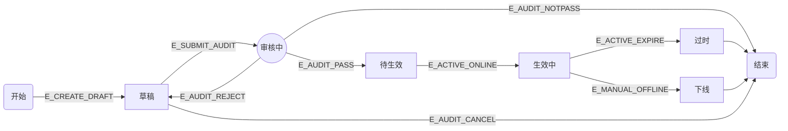
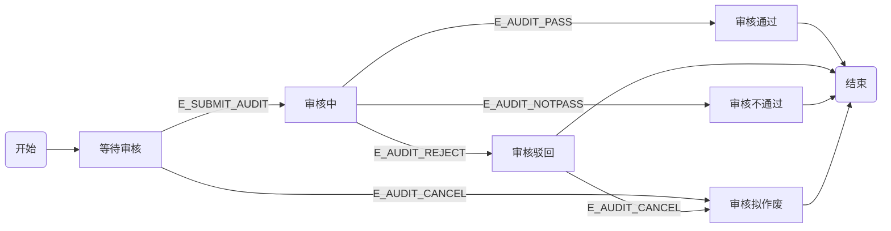

# 促销活动管理标准化系统 - 设计文档

## 1. 架构设计

### 1.1 架构选型：事件驱动架构（EDA）+ DDD领域驱动设计

```
┌─────────────────────────────────────────────────────────────────────┐
│                        接入层 (Access Layer)                         │
│  ┌─────────────┐  ┌─────────────┐  ┌─────────────┐  ┌─────────────┐ │
│  │  Admin API  │  │  Audit API  │  │ Query API   │  │Customer API │ │
│  └──────┬──────┘  └──────┬──────┘  └──────┬──────┘  └──────┬──────┘ │
└─────────┼────────────────┼────────────────┼────────────────┼─────────┘
          │                │                │                │
          ▼                ▼                ▼                ▼
┌─────────────────────────────────────────────────────────────────────┐
│                     应用服务层 (Application Layer)                   │
│  ┌─────────────┐  ┌─────────────┐  ┌─────────────┐  ┌─────────────┐ │
│  │PromotionApp │  │  AuditApp   │  │  QueryApp   │  │  UserApp    │ │
│  │   Service   │  │   Service   │  │   Service   │  │   Service   │ │
│  └──────┬──────┘  └──────┬──────┘  └──────┬──────┘  └──────┬──────┘ │
└─────────┼────────────────┼────────────────┼────────────────┼─────────┘
          │                │                │                │
          └────────────────┴────────────────┼────────────────┘
                                           │
                                           ▼
┌─────────────────────────────────────────────────────────────────────┐
│                     事件分发中心 (Event Bus)                         │
│  ┌─────────────┐  ┌─────────────┐  ┌─────────────┐                 │
│  │ Event       │  │ Event       │  │ Event       │                 │
│  │ Producer    │  │  Router     │  │ Consumer    │                 │
│  └──────┬──────┘  └──────┬──────┘  └──────┬──────┘                 │
└─────────┼────────────────┼────────────────┼─────────────────────────┘
          │                │                │
          │                └────────┬───────┘
          │                         │
          ▼                         ▼
┌─────────────────────────────────────────────────────────────────────┐
│                    领域层 (Domain Layer)                            │
│  ┌─────────────────────────────┐  ┌─────────────────────────────┐  │
│  │       Promotion Domain      │  │        Audit Domain         │  │
│  │  ┌─────────────────────┐    │  │  ┌─────────────────────┐    │  │
│  │  │ PromotionEntity     │    │  │  │ AuditRecordEntity   │    │  │
│  │  │ PromotionStateEngine│    │  │  │ AuditStateEngine    │    │  │
│  │  │ PromotionRepository │    │  │  │ AuditRepository     │    │  │
│  │  └─────────────────────┘    │  │  └─────────────────────┘    │  │
│  └─────────────────────────────┘  └─────────────────────────────┘  │
│  ┌─────────────────────────────┐  ┌─────────────────────────────┐  │
│  │        Event Domain         │  │         User Domain         │  │
│  │  ┌─────────────────────┐    │  │  ┌─────────────────────┐    │  │
│  │  │ EventEntity         │    │  │  │ UserEntity          │    │  │
│  │  │ EventLogRepository  │    │  │  │ UserRepository      │    │  │
│  │  └─────────────────────┘    │  │  └─────────────────────┘    │  │
│  └─────────────────────────────┘  └─────────────────────────────┘  │
└─────────────────────────────────────────────────────────────────────┘
                                          │
                                          ▼
┌─────────────────────────────────────────────────────────────────────┐
│                      数据持久层 (Repository Layer)                   │
│  ┌─────────────┐  ┌─────────────┐  ┌─────────────┐  ┌─────────────┐ │
│  │ UserRepo    │  │PromotionRepo│  │PromoSkuRepo │  │ EventLogRepo│ │
│  └─────────────┘  └─────────────┘  └─────────────┘  └─────────────┘ │
└─────────────────────────────────────────────────────────────────────┘
```

### 1.2 核心设计原则

| 原则 | 说明 |
| :--- | :--- |
| **事件驱动** | 所有业务行为产生标准化事件，事件为唯一驱动源 |
| **双状态机联动** | 活动状态机与审核状态机独立维护，通过事件双向触发 |
| **终态保护** | 已进入终态的状态机禁止再次触发变更事件 |
| **DDD领域划分** | 按领域边界划分模块，确保高内聚低耦合 |

---

## 2. DDD领域模块设计

### 2.1 领域边界定义

| 领域模块 | 职责说明 | 核心实体 | 聚合根 |
| :--- | :--- | :--- | :--- |
| **促销活动域** | 活动生命周期管理、状态流转 | Promotion, PromotionSku | Promotion |
| **SKU管理域** | SKU生命周期管理、SKU信息查询 | Sku | Sku |
| **审核流程域** | 审批流程管理、审核状态流转 | AuditRecord | AuditRecord |
| **事件总线域** | 事件生产、分发、路由、持久化 | Event, EventLog | Event |
| **用户域** | 用户认证、权限管理 | User, Role | User |

### 2.2 领域服务设计

#### 2.2.1 促销活动域服务

| 服务名称 | 职责说明 | 核心方法 |
| :--- | :--- | :--- |
| `PromotionDomainService` | 活动生命周期业务逻辑 | `createDraft()`, `submitAudit()`, `goOnline()`, `goOffline()`, `expire()` |
| `PromotionStateEngine` | 活动状态机流转引擎 | `transition()`, `validateTransition()` |

#### 2.2.2 SKU管理域服务

| 服务名称 | 职责说明 | 核心方法 |
| :--- | :--- | :--- |
| `SkuDomainService` | SKU生命周期管理 | `createSku()`, `updateSku()`, `deleteSku()`, `listSku()` |
| `SkuRepository` | SKU数据访问 | `findBySkuId()`, `save()`, `update()`, `delete()` |

#### 2.2.3 审核流程域服务

| 服务名称 | 职责说明 | 核心方法 |
| :--- | :--- | :--- |
| `AuditDomainService` | 审核流程业务逻辑 | `pass()`, `reject()`, `notPass()`, `cancel()` |
| `AuditStateEngine` | 审核状态机流转引擎 | `transition()`, `validateTransition()` |

#### 2.2.4 事件总线域服务

| 服务名称 | 职责说明 | 核心方法 |
| :--- | :--- | :--- |
| `EventBusService` | 事件生产与分发 | `produce()`, `dispatch()`, `route()` |
| `EventLogService` | 事件日志管理 | `record()`, `query()`, `replay()` |

---

## 3. 状态机设计

### 3.1 活动状态机



### 3.2 审核状态机



---

## 4. 数据库设计

### 4.1 表结构设计

#### 4.1.1 用户表（user）

| 字段名 | 类型 | 约束 | 说明 |
| :--- | :--- | :--- | :--- |
| `user_id` | VARCHAR(36) | PRIMARY KEY | 用户唯一标识 |
| `username` | VARCHAR(50) | NOT NULL, UNIQUE | 用户名 |
| `password` | VARCHAR(100) | NOT NULL | 加密密码 |
| `role` | INT | NOT NULL | 角色：1-管理员，2-审核员 |
| `ctime` | DATETIME | NOT NULL | 创建时间 |
| `utime` | DATETIME | | 更新时间 |

#### 4.1.2 活动表（promotion）

| 字段名 | 类型 | 约束 | 说明 |
| :--- | :--- | :--- | :--- |
| `promotion_id` | VARCHAR(36) | PRIMARY KEY | 活动唯一标识 |
| `name` | VARCHAR(100) | NOT NULL | 促销名称 |
| `stime` | DATETIME | NOT NULL | 开始时间 |
| `etime` | DATETIME | NOT NULL | 结束时间 |
| `creator` | VARCHAR(36) | NOT NULL, FOREIGN KEY | 创建人 |
| `operator` | VARCHAR(36) | FOREIGN KEY | 最近操作人 |
| `status` | INT | NOT NULL, DEFAULT 0 | 活动状态 |
| `audit_status` | INT | NOT NULL, DEFAULT 0 | 审核状态 |
| `ctime` | DATETIME | NOT NULL | 创建时间 |
| `utime` | DATETIME | | 更新时间 |

#### 4.1.3 活动-SKU关联表（promotion_sku）

| 字段名 | 类型 | 约束 | 说明 |
| :--- | :--- | :--- | :--- |
| `id` | VARCHAR(36) | PRIMARY KEY | 记录唯一标识 |
| `promotion_id` | VARCHAR(36) | NOT NULL, FOREIGN KEY | 活动ID |
| `sku_id` | VARCHAR(36) | NOT NULL, FOREIGN KEY | SKU ID |
| `discount` | DECIMAL(4,2) | NOT NULL | 折扣（0.01-1.00） |

#### 4.1.4 SKU表（sku）

| 字段名 | 类型 | 约束 | 说明 |
| :--- | :--- | :--- | :--- |
| `sku_id` | VARCHAR(36) | PRIMARY KEY | SKU唯一标识 |
| `sku_name` | VARCHAR(200) | NOT NULL | SKU名称 |
| `original_price` | DECIMAL(10,2) | NOT NULL | 原价 |

#### 4.1.5 审核记录表（audit_record）

| 字段名 | 类型 | 约束 | 说明 |
| :--- | :--- | :--- | :--- |
| `audit_id` | VARCHAR(36) | PRIMARY KEY | 审核记录唯一标识 |
| `promotion_id` | VARCHAR(36) | NOT NULL, FOREIGN KEY | 关联活动ID |
| `audit_status` | INT | NOT NULL, DEFAULT 0 | 审核状态 |
| `submit_time` | DATETIME | | 提交审核时间 |
| `complete_time` | DATETIME | | 完成审核时间 |
| `auditor_id` | VARCHAR(36) | FOREIGN KEY | 审核员用户ID |
| `comment` | VARCHAR(500) | | 审核意见 |
| `ctime` | DATETIME | NOT NULL | 创建时间 |
| `utime` | DATETIME | | 更新时间 |

#### 4.1.6 事件日志表（event_log）

| 字段名 | 类型 | 约束 | 说明 |
| :--- | :--- | :--- | :--- |
| `event_id` | VARCHAR(36) | PRIMARY KEY | 事件唯一标识 |
| `event_type` | VARCHAR(50) | NOT NULL | 事件类型 |
| `promotion_id` | VARCHAR(36) | FOREIGN KEY | 活动ID |
| `prev_activity_status` | INT | | 前置活动状态 |
| `prev_audit_status` | INT | | 前置审核状态 |
| `operator` | VARCHAR(36) | FOREIGN KEY | 操作人 |
| `event_time` | DATETIME | NOT NULL | 事件时间 |
| `params` | TEXT | | 事件参数JSON |

---

## 5. API接口设计

### 5.1 活动管理接口

| API路径 | HTTP方法 | Controller | Service | 功能描述 |
| :--- | :--- | :--- | :--- | :--- |
| `/api/promotion/create` | POST | `PromotionController` | `PromotionAppService` | 创建活动草稿 |
| `/api/promotion/update` | PUT | `PromotionController` | `PromotionAppService` | 更新活动信息 |
| `/api/promotion/delete/{id}` | DELETE | `PromotionController` | `PromotionAppService` | 删除活动 |
| `/api/promotion/submit-audit/{id}` | POST | `PromotionController` | `PromotionAppService` | 提交审核 |
| `/api/promotion/offline/{id}` | POST | `PromotionController` | `PromotionAppService` | 手动下线 |
| `/api/promotion/list` | GET | `PromotionController` | `QueryAppService` | 查询活动列表 |
| `/api/promotion/{id}` | GET | `PromotionController` | `QueryAppService` | 查询活动详情 |

### 5.2 审核流程接口

| API路径 | HTTP方法 | Controller | Service | 功能描述 |
| :--- | :--- | :--- | :--- | :--- |
| `/api/audit/pass/{promotionId}` | POST | `AuditController` | `AuditAppService` | 审核通过 |
| `/api/audit/reject/{promotionId}` | POST | `AuditController` | `AuditAppService` | 审核驳回 |
| `/api/audit/notpass/{promotionId}` | POST | `AuditController` | `AuditAppService` | 审核不通过 |
| `/api/audit/cancel/{promotionId}` | POST | `AuditController` | `AuditAppService` | 审核作废 |
| `/api/audit/status/{promotionId}` | GET | `AuditController` | `QueryAppService` | 查询审核状态 |

### 5.3 用户管理接口

| API路径 | HTTP方法 | Controller | Service | 功能描述 |
| :--- | :--- | :--- | :--- | :--- |
| `/api/user/login` | POST | `UserController` | `UserAppService` | 用户登录 |
| `/api/user/logout` | POST | `UserController` | `UserAppService` | 用户登出 |
| `/api/user/{id}` | GET | `UserController` | `UserAppService` | 查询用户详情 |
| `/api/user/register` | POST | `UserController` | `UserAppService` | 用户注册 |
| `/api/user/update` | PUT | `UserController` | `UserAppService` | 更新用户信息 |

### 5.4 SKU管理接口

| API路径 | HTTP方法 | Controller | Service | 功能描述 |
| :--- | :--- | :--- | :--- | :--- |
| `/api/sku/create` | POST | `SkuController` | `SkuDomainService` | 创建SKU |
| `/api/sku/update` | PUT | `SkuController` | `SkuDomainService` | 更新SKU信息 |
| `/api/sku/delete/{id}` | DELETE | `SkuController` | `SkuDomainService` | 删除SKU |
| `/api/sku/{id}` | GET | `SkuController` | `SkuDomainService` | 查询SKU详情 |
| `/api/sku/list` | GET | `SkuController` | `SkuDomainService` | 查询SKU列表 |

### 5.5 外部客户接口

| API路径 | HTTP方法 | Controller | Service | 功能描述 |
| :--- | :--- | :--- | :--- | :--- |
| `/api/customer/promotion/{id}` | GET | `CustomerController` | `QueryAppService` | 查询活动详情 |
| `/api/customer/sku/{id}` | GET | `CustomerController` | `QueryAppService` | 查询SKU折扣 |
| `/api/customer/sku` | GET | `CustomerController` | `QueryAppService` | 查询活动SKU列表 |

---

## 6. 核心类设计

### 6.1 实体类

| 类名 | 所属包 | 职责说明 |
| :--- | :--- | :--- |
| `User` | `com.sa.promotion.domain.user.entity` | 用户实体 |
| `Promotion` | `com.sa.promotion.domain.promotion.entity` | 活动实体 |
| `PromotionSku` | `com.sa.promotion.domain.promotion.entity` | 活动SKU关联实体 |
| `Sku` | `com.sa.promotion.domain.sku.entity` | SKU实体 |
| `AuditRecord` | `com.sa.promotion.domain.audit.entity` | 审核记录实体 |
| `Event` | `com.sa.promotion.domain.event.entity` | 事件实体 |
| `EventLog` | `com.sa.promotion.domain.event.entity` | 事件日志实体 |

### 6.2 状态枚举类

| 枚举类 | 所属包 | 说明 |
| :--- | :--- | :--- |
| `PromotionStatus` | `com.sa.promotion.domain.promotion.enums` | 活动状态枚举 |
| `AuditStatus` | `com.sa.promotion.domain.audit.enums` | 审核状态枚举 |
| `EventType` | `com.sa.promotion.domain.event.enums` | 事件类型枚举 |

### 6.3 状态机引擎类

| 类名 | 所属包 | 职责说明 |
| :--- | :--- | :--- |
| `PromotionStateEngine` | `com.sa.promotion.domain.promotion.engine` | 活动状态机引擎 |
| `AuditStateEngine` | `com.sa.promotion.domain.audit.engine` | 审核状态机引擎 |
| `StateMachineLinkageValidator` | `com.sa.promotion.domain.engine` | 双状态机联动校验器 |

### 6.4 SKU管理类

| 类名 | 所属包 | 职责说明 |
| :--- | :--- | :--- |
| `Sku` | `com.sa.promotion.domain.sku.entity` | SKU实体 |
| `SkuDomainService` | `com.sa.promotion.domain.sku.service` | SKU领域服务 |
| `SkuRepository` | `com.sa.promotion.domain.sku.repository` | SKU仓储接口 |

---

## 7. 开发任务 Todo List

### 7.1 数据库层开发

| 序号 | 任务名称 | 描述 | 状态 | 优先级 |
| :--- | :--- | :--- | :--- | :--- |
| DB-001 | 创建用户表 | 设计并创建user表结构 | done | 高 |
| DB-002 | 创建活动表 | 设计并创建promotion表结构 | done | 高 |
| DB-003 | 创建活动-SKU关联表 | 设计并创建promotion_sku表结构 | done | 高 |
| DB-004 | 创建SKU表 | 设计并创建sku表结构 | done | 高 |
| DB-005 | 创建事件日志表 | 设计并创建event_log表结构 | done | 高 |

### 7.2 领域层开发

| 序号 | 任务名称 | 描述 | 状态 | 优先级 |
| :--- | :--- | :--- | :--- | :--- |
| DOM-001 | 创建用户实体 | 实现User实体类 | done | 高 |
| DOM-002 | 创建活动实体 | 实现Promotion实体类 | done | 高 |
| DOM-003 | 创建SKU实体 | 实现Sku和PromotionSku实体类 | done | 高 |
| DOM-004 | 创建审核实体 | 实现AuditRecord实体类 | done | 高 |
| DOM-005 | 创建事件实体 | 实现Event和EventLog实体类 | done | 高 |
| DOM-006 | 创建状态枚举 | 实现PromotionStatus、AuditStatus枚举 | done | 高 |
| DOM-007 | 创建事件类型枚举 | 实现EventType枚举 | done | 高 |
| DOM-008 | 实现活动状态机引擎 | PromotionStateEngine核心逻辑 | done | 高 |
| DOM-009 | 实现审核状态机引擎 | AuditStateEngine核心逻辑 | done | 高 |
| DOM-010 | 实现双状态机联动校验器 | StateMachineLinkageValidator | done | 高 |
| DOM-011 | 实现促销活动域服务 | PromotionDomainService | done | 高 |
| DOM-012 | 实现审核流程域服务 | AuditDomainService | done | 高 |
| DOM-013 | 实现事件总线服务 | EventBusService | done | 高 |
| DOM-014 | 实现事件日志服务 | EventLogService | done | 高 |
| DOM-015 | 实现SKU管理域服务 | SkuDomainService | done | 高 |
| DOM-016 | 实现SKU仓储接口 | SkuRepository | done | 高 |

### 7.3 应用层开发

| 序号 | 任务名称 | 描述 | 状态 | 优先级 |
| :--- | :--- | :--- | :--- | :--- |
| APP-001 | 实现用户应用服务 | UserAppService | done | 高 |
| APP-002 | 实现活动应用服务 | PromotionAppService | done | 高 |
| APP-003 | 实现审核应用服务 | AuditAppService | done | 高 |
| APP-004 | 实现查询应用服务 | QueryAppService | done | 高 |
| APP-005 | 实现定时任务服务 | 自动生效、自动过期定时任务 | done | 高 |

### 7.4 控制器层开发

| 序号 | 任务名称 | 描述 | 状态 | 优先级 |
| :--- | :--- | :--- | :--- | :--- |
| CTRL-001 | 实现用户控制器 | UserController | done | 高 |
| CTRL-002 | 实现活动控制器 | PromotionController | done | 高 |
| CTRL-003 | 实现审核控制器 | AuditController | done | 高 |
| CTRL-004 | 实现客户控制器 | CustomerController | done | 高 |
| CTRL-005 | 实现SKU管理控制器 | SkuController | done | 高 |

### 7.5 DTO层开发

| 序号 | 任务名称 | 描述 | 状态 | 优先级 |
| :--- | :--- | :--- | :--- | :--- |
| DTO-001 | 创建请求DTO | 各接口请求参数DTO | done | 高 |
| DTO-002 | 创建响应DTO | 各接口响应数据DTO | done | 高 |
| DTO-003 | 创建事件DTO | EventDTO事件传输对象 | cancelled | 高 |
| DTO-004 | 创建SKU相关DTO | SkuRequest/SkuResponse DTO | done | 高 |

### 7.6 配置与基础设施

| 序号 | 任务名称 | 描述 | 状态 | 优先级 |
| :--- | :--- | :--- | :--- | :--- |
| INF-001 | 配置数据库连接 | application.properties | done | 高 |
| INF-002 | 配置事件总线 | 消息队列/事件分发配置 | done | 高 |
| INF-003 | 配置定时任务 | @EnableScheduling配置 | done | 高 |
| INF-005 | 配置日志 | logback配置 | done | 中 |

### 7.7 测试与验证

| 序号 | 任务名称 | 描述 | 状态 | 优先级 |
| :--- | :--- | :--- | :--- | :--- |
| TEST-001 | 单元测试-状态机引擎 | 活动/审核状态机流转测试 | done | 高 |
| TEST-002 | 单元测试-事件总线 | 事件生产/分发测试 | done | 高 |
| TEST-003 | 集成测试-活动流程 | 创建→提交→审核→生效完整流程 | done | 高 |
| TEST-004 | 集成测试-审核流程 | 审核通过/驳回/不通过/作废测试 | done | 高 |
| TEST-005 | 集成测试-定时任务 | 自动生效/过期测试 | done | 高 |
| TEST-006 | 单元测试-SKU管理 | SKU增删改查功能测试 | done | 高 |
| TEST-007 | 集成测试-SKU管理 | SKU完整业务流程测试 | done | 高 |
