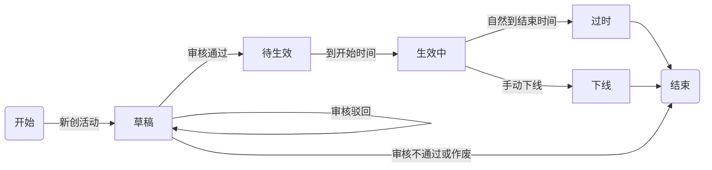
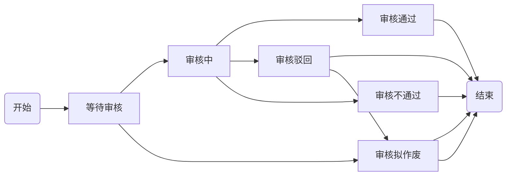
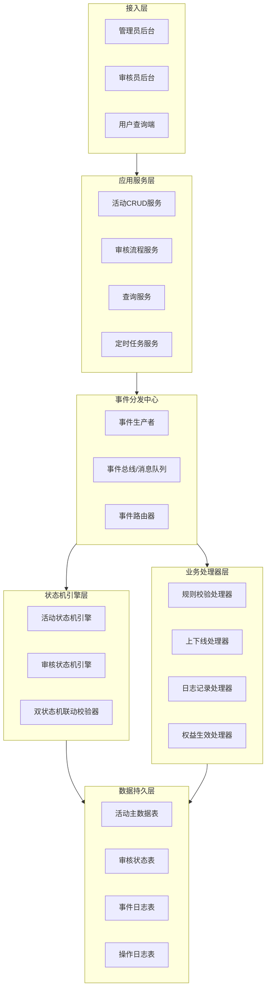

促销活动管理标准化系统——事件驱动架构设计文档
1. 文档概述
1.1 文档目的
本文档基于前期需求分析、用例分析成果，针对促销活动管理系统**双状态机流转特性**，采用事件驱动架构（EDA）完成系统整体架构设计。定义系统分层架构、核心事件模型、双状态机联动规则、事件流转链路、技术选型与落地约束，为系统开发、状态流转、业务解耦、迭代扩展提供架构级依据。
1.2 架构设计背景
本系统核心业务为促销活动全生命周期管理，核心特征为状态驱动业务、事件触发流转。活动存在两套独立且联动的状态机：活动状态机（控制活动生命周期）、审核状态机（控制审批流程）。传统同步架构存在耦合度高、状态流转僵硬、扩展能力弱、流程联动复杂等问题。
基于业务特性选用事件驱动架构，通过事件触发状态变更、业务联动、异步处理，实现审核流程、活动生命周期、上下线、过期作废等业务解耦，保障双状态机精准、独立、联动流转。
1.3 核心约束
•	系统存在双状态机隔离联动机制：活动状态机、审核状态机独立维护，通过事件双向触发联动；
•	所有状态变更、业务操作均由事件驱动触发，禁止硬编码直接修改状态；
•	所有事件可追溯、可重试、可回放，保障状态机数据一致性。
1.4 状态机原始定义
1.4.1 活动状态机（生命周期状态）

1.4.2 审核状态机（审批流转状态）

2. 架构总体设计
2.1 架构选型：事件驱动架构（EDA）
本系统采用事件驱动架构，核心思想：所有业务行为（创建、提交、审核、到期、下线、作废）均产生标准化事件，系统通过监听事件，触发对应状态机流转、业务逻辑、数据更新、消息通知。
核心优势适配本系统业务：
•	解耦性强：审核流程、活动生命周期、用户查询、日志记录完全解耦；
•	状态可控：双状态机变更统一由事件驱动，杜绝状态混乱、非法流转；
•	可扩展高：新增促销规则、审核节点、运维流程仅需新增事件监听，无需改动核心流程；
•	可追溯可重试：事件日志持久化，支持状态回查、异常重试、问题定位。
2.2 整体分层架构图

2.3 各层级核心职责
2.3.1 接入层
提供三类终端入口，接收用户操作请求，统一请求入参、权限校验、参数校验，向上游服务转发请求，包含管理员活动管理端、审核员审核端、消费者优惠查询端。
2.3.2 应用服务层
承接前端业务请求，完成业务预处理，生产标准化业务事件，投递至事件分发中心，不直接处理状态变更与底层逻辑，保持服务轻量化。包含活动增删改查、审核提交、条件查询、定时到期检测等服务能力。
2.3.3 事件分发中心（架构核心）
系统核心枢纽，统一生产、分发、路由所有业务事件，实现事件的异步解耦处理。根据事件类型，路由至状态机引擎或对应业务处理器，是双状态机联动的核心调度层。
2.3.4 状态机引擎层（核心核心）
系统最核心层级，独立维护活动状态机与审核状态机，接收事件驱动状态流转，内置状态合法性校验、跨状态拦截、双状态联动规则，杜绝非法状态跳转，保证全流程状态一致性。
2.3.5 业务处理器层
监听对应事件，执行附属业务逻辑，包括活动规则自动校验、权益生效/失效、手动下线处理、全量日志记录、数据统计等通用能力。
2.3.6 数据持久层
持久化活动数据、双状态机状态数据、全量事件日志、操作日志、审核日志，支撑数据追溯与状态恢复。
3. 核心事件模型设计
所有状态流转、业务操作均对应标准化事件，事件为系统唯一驱动源。统一事件结构：事件ID、事件类型、活动ID、前置活动状态、前置审核状态、操作人、事件时间、事件参数。
3.1 核心事件枚举定义
事件编码	事件名称	触发角色/主体	核心作用
E_CREATE_DRAFT	创建草稿事件	管理员	生成草稿活动，初始化双状态机初始状态
E_SUBMIT_AUDIT	提交审核事件	管理员	审核状态由【等待审核】→【审核中】
E_AUDIT_PASS	审核通过事件	审核员	审核状态完结，活动状态由【草稿】→【待生效】
E_AUDIT_REJECT	审核驳回事件	审核员	审核状态流转驳回，活动状态保持草稿
E_AUDIT_NOTPASS	审核不通过事件	审核员	审核终止，活动状态终结
E_AUDIT_CANCEL	审核作废事件	审核员	审核状态作废，活动状态终结
E_ACTIVE_ONLINE	活动自动生效事件	系统定时任务	到达开始时间，活动由【待生效】→【生效中】
E_ACTIVE_EXPIRE	活动过期事件	系统定时任务	到达结束时间，活动由【生效中】→【过时】终结
E_MANUAL_OFFLINE	手动下线事件	管理员	生效中活动强制下线，状态终结
E_UPDATE_ACTIVITY	活动更新事件	管理员	更新活动信息，触发前置规则校验
E_DELETE_ACTIVITY	活动删除事件	管理员	先下线、再删除，记录删除事件
4. 双状态机事件联动核心设计
4.1 双状态机核心关系
1. 审核状态机为前置驱动：所有活动能否进入生效周期，完全依赖审核状态机结果；
2. 活动状态机为生命周期载体：管控活动草稿、待生效、生效、过期、下线全生命周期；
3. 事件单向+双向联动：审核事件驱动活动状态变更，活动终止事件同步固化审核终态。
4.2 关键联动事件流转规则
4.2.1 活动创建草稿链路
触发事件：E_CREATE_DRAFT
状态结果：
•	活动状态机：开始 → 草稿
•	审核状态机：开始 → 等待审核
4.2.2 提交审核链路
触发事件：E_SUBMIT_AUDIT
状态结果：
•	活动状态机：保持草稿
•	审核状态机：等待审核 → 审核中
4.2.3 审核通过链路
触发事件：E_AUDIT_PASS
状态结果：
•	审核状态机：审核中 → 审核通过（终态）
•	活动状态机：草稿 → 待生效
4.2.4 审核驳回链路
触发事件：E_AUDIT_REJECT
状态结果：
•	审核状态机：审核中 → 审核驳回（终态）
•	活动状态机：保持草稿，支持重新编辑提交
4.2.5 审核不通过链路
触发事件：E_AUDIT_NOTPASS
状态结果：
•	审核状态机：审核中 → 审核不通过（终态）
•	活动状态机：草稿 → 结束（终止）
4.2.6 活动作废链路
触发事件：E_AUDIT_CANCEL
适用场景：等待审核、已驳回状态活动
状态结果：
•	审核状态机：等待审核/驳回 → 审核拟作废（终态）
•	活动状态机：草稿 → 结束（终止）
4.2.7 活动自动生效链路
触发事件：E_ACTIVE_ONLINE（定时事件）
状态结果：
•	活动状态机：待生效 → 生效中
•	审核状态机：保持已通过终态
4.2.8 活动自然过期链路
触发事件：E_ACTIVE_EXPIRE（定时事件）
状态结果：
•	活动状态机：生效中 → 过时 → 结束
•	审核状态机：保持已通过终态
4.2.9 手动下线链路
触发事件：E_MANUAL_OFFLINE
状态结果：
•	活动状态机：生效中 → 下线 → 结束
•	审核状态机：保持已通过终态
4.3 状态机流转拦截规则（架构强约束）
•	所有状态变更必须由事件触发，禁止业务代码直接update状态字段；
•	状态机引擎前置校验流转合法性，非法事件直接拦截并记录异常日志；
•	已进入终态的双状态机，禁止再次触发任何变更事件；
•	审核未完成的活动，无法触发生效、过期、下线等生命周期事件。
5. 核心业务链路架构流程
5.1 完整活动创建至生效流程
管理员创建活动→参数校验通过→生产【创建草稿事件】→双状态机初始化→保存草稿→管理员提交审核→生产【提交审核事件】→审核状态变更为审核中→审核员审核通过→生产【审核通过事件】→活动状态转为待生效→定时任务监听时间→触发【自动生效事件】→活动生效对外提供优惠
5.2 活动终止流程（多场景统一收口）
审核不通过/审核作废/手动下线/自然过期 → 对应事件触发 → 活动状态机进入终态 → 关闭商品优惠权益 → 记录事件日志与操作日志 → 流程闭环

附：库表设计

管理/审核人员设计表字段
|字段|说明|
|-|-|
|userId|主键|
|role|1为管理员，2为审核员|
|username|用户名|
|password|密码|
|ctime|注册时间|
|utime|更新信息时间|

活动设计表字段

|字段|说明|
|-|-|
|promotion_id|主键|
|name|促销名字|
|ctime|创建时间|
|utime|更新时间|
|stime|活动开始时间|
|etime|活动结束时间|
|operator|最近一次操作的管理员员|
|creator|活动创建者|
|status|状态，整数字段|
|audit_status|审核状态，整数字段|

活动-sku表字段
|字段|说明|
|-|-|
|id|主键|
|promotion_id|活动id|
|sku_id|skuId|
|discount|折扣，打几折，两位小数|

sku表字段

|字段|说明|
|-|-|
|sku_id|sku的主键|
|sku_name|sku的名字|
|original_price|原价，打折前的价格|