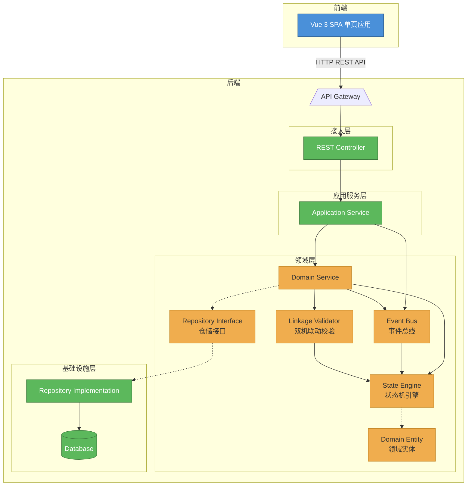
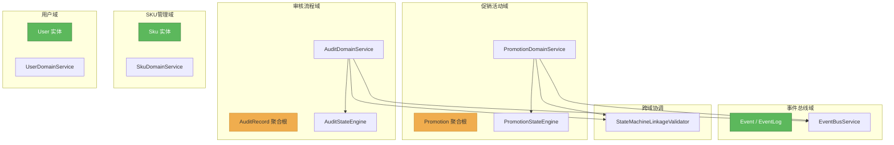
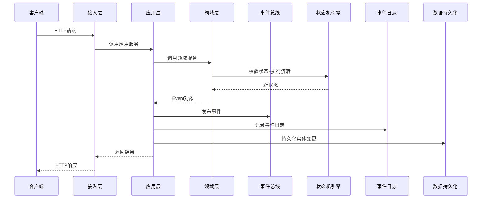
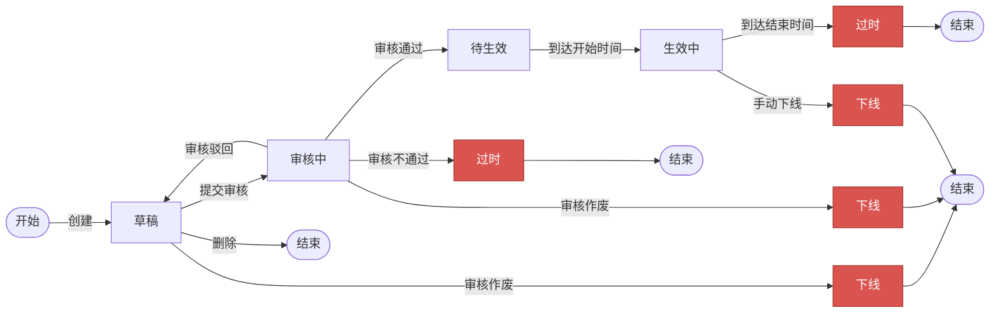
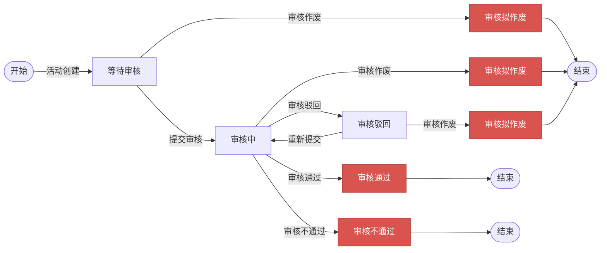
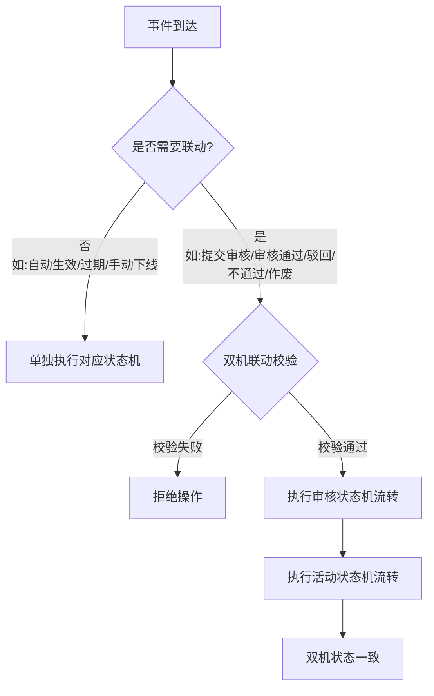
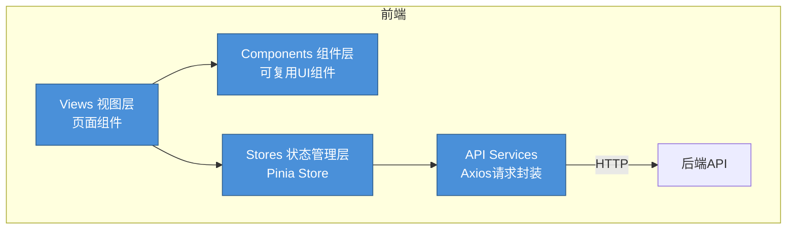

# 促销活动管理系统 —— 架构设计决策

## 1. 架构总览

本系统采用**分层架构（DDD四层）** 与**事件驱动架构（EDA）** 的组合风格，围绕促销活动双状态机流转这一核心业务特征进行设计。

### 1.1 为什么采用组合架构

促销活动管理的核心特征是**状态驱动**——活动从创建到结束经历多个状态，每个业务操作本质上是一次状态变更。这个特征带来三个架构挑战：

| 挑战 | 说明 |
|:---|:---|
| **状态流转复杂** | 活动状态（草稿→审核中→待生效→生效中→过时/下线）与审核状态（等待审核→审核中→通过/驳回/不通过/作废）相互联动，存在近20种合法流转路径 |
| **触发源多样** | 状态变更由管理员操作、审核员操作、系统定时任务三种不同触发源驱动 |
| **扩展需求明确** | 未来可能新增活动状态、审核节点、业务规则，需要架构支持灵活扩展 |

分层架构（DDD）解决"如何组织代码"的问题——按领域边界划分模块，确保业务逻辑内聚。事件驱动架构（EDA）解决"如何驱动流转"的问题——所有操作产生标准化事件，统一触发状态变更。

### 1.2 架构全景图

---

## 2. 分层架构设计（DDD）

### 2.1 四层职责

| 层级 | 职责 | 依赖方向 |
|:---|:---|:---|
| **Interfaces（接入层）** | 接收HTTP请求，参数校验，协议转换（JSON→DTO），调用应用服务 | ↓ Application |
| **Application（应用层）** | 业务流程编排，跨域协调，事务边界管理，事件发布与日志记录 | ↓ Domain |
| **Domain（领域层）** | 核心业务逻辑：状态机引擎、双机联动校验、领域服务、实体定义、仓储接口定义 | 不依赖上层 |
| **Infrastructure（基础设施层）** | 数据持久化实现，数据库访问，TypeHandler类型转换 | 实现Domain定义的仓储接口 |

**核心原则**：依赖方向从上到下，Domain层处于中心位置不依赖任何上层，Infrastructure层通过依赖倒置实现Domain定义的接口。

### 2.2 领域模块划分

按促销活动管理系统的业务边界，将Domain层划分为五个子领域：

| 领域模块 | 聚合根 | 核心职责 |
|:---|:---|:---|
| **促销活动域** | Promotion | 活动生命周期管理，SKU关联与折扣，状态流转入口 |
| **审核流程域** | AuditRecord | 审核流转管理，审核意见记录 |
| **SKU管理域** | Sku | SKU基本信息管理（名称、原价） |
| **事件总线域** | Event | 事件的发布、订阅、路由、持久化 |
| **用户域** | User | 用户认证，角色管理 |

**领域隔离原则**：每个子领域只操作自己的聚合根，跨领域操作通过事件总线或联动校验器协调。例如：SKU域的变更不会直接影响活动域的代码。

### 2.3 聚合根设计

| 聚合根 | 所属域 | 内部值对象 | 不变条件（Invariant） |
|:---|:---|:---|:---|
| Promotion | 促销活动域 | PromotionSku（SKU关联+折扣） | 状态与审核状态的组合必须合法；折扣必须在0.01~1.00之间；时间范围必须合法 |
| AuditRecord | 审核流程域 | — | 审核状态流转必须符合状态机规则 |
| Sku | SKU管理域 | — | 原价必须为正数 |
| Event | 事件总线域 | — | 事件类型编码不可为空；必须关联合法的活动ID |
| User | 用户域 | — | 用户名唯一；密码不可明文 |

---

## 3. 事件驱动架构设计（EDA）

### 3.1 设计思路

在分层架构的基础上，事件驱动架构定义了**业务流转的方式**：

- 所有业务操作（创建、提交、审核、下线、过期）产生一个标准化事件
- 事件通过事件总线发布
- 状态机引擎接收事件，校验合法性，执行状态流转
- 所有事件被持久化到事件日志，支持审计和回溯

这与分层架构的关系是**正交互补**的：分层架构定义代码如何组织，事件驱动架构定义业务如何流转。

### 3.2 事件驱动流程

关键设计：事件在Domain层构建，在Application层统一发布和记录，确保事务边界清晰。

### 3.3 双状态机设计

#### 活动状态机

#### 审核状态机

#### 状态机引擎设计

两个状态机引擎各自维护一个 **Transition Table（状态转换规则表）**，结构为：

> 当前状态 → (事件类型 → 目标状态)

每次状态变更前执行两层校验：
1. **终态保护**：检查当前状态是否为终态，是则直接拒绝
2. **合法性校验**：在Transition Table中查找"当前状态+事件类型"是否存在合法目标状态

这种Table-Driven的设计将状态流转规则集中在一处，新增状态只需修改Transition Table数据，不需改动流转逻辑。

### 3.4 双状态机联动机制

活动状态机和审核状态机通过 `StateMachineLinkageValidator`（双状态机联动校验器）实现联动。该组件作为一个独立的跨域协调单元，被活动域服务和审核域服务共同引用。

联动事件及其效果：

| 事件 | 审核状态流转 | 活动状态流转 |
|:---|:---|:---|
| 提交审核 | 等待审核/驳回 → 审核中 | 草稿 → 审核中 |
| 审核通过 | 审核中 → 审核通过（终态） | 审核中 → 待生效 |
| 审核驳回 | 审核中 → 审核驳回 | 审核中 → 草稿 |
| 审核不通过 | 审核中 → 审核不通过（终态） | 审核中 → 过时（终态） |
| 审核作废 | 等待审核/驳回 → 审核拟作废（终态） | 草稿/审核中 → 下线（终态） |

### 3.5 事件总线设计

事件总线（EventBus）采用 **发布-订阅（Pub-Sub）** 模式：

- **发布者**：领域服务产生事件后，由应用层统一调用 `publish(event)`
- **订阅者**：按事件类型注册处理器，一个事件类型可注册多个处理器
- **路由**：根据事件类型编码查找对应的处理器列表并依次调用
- **容错**：单个处理器异常不影响其他处理器的执行

当前实现为内存同步模型，架构上预留了向异步消息队列（如RabbitMQ、Kafka）迁移的扩展点。

### 3.6 事件持久化与审计

每个事件在发布的同时被持久化到事件日志中，记录内容包括：

| 字段 | 说明 |
|:---|:---|
| 事件ID | 唯一标识 |
| 事件类型 | 操作类型编码 |
| 关联活动ID | 被操作的活动 |
| 操作前活动状态 | 流转前的活动状态 |
| 操作前审核状态 | 流转前的审核状态 |
| 操作人 | 触发操作的用户 |
| 操作时间 | 事件发生时间 |
| 附加参数 | 审核意见等扩展信息 |

这使得任意时间点的活动状态都可以通过事件日志回溯。

---

## 4. 前端架构设计

前端采用与后端分层一一对应的四层架构：

| 前端层 | 后端对应 | 职责 |
|:---|:---|:---|
| Views（视图层） | Interfaces | 页面组装，用户交互 |
| Components（组件层） | — | 可复用的UI组件（状态标签、活动表单、审核面板、SKU选择器、事件时间线） |
| Stores（状态管理层） | Application | 状态集中管理，API调用封装，操作级权限计算 |
| API Services | — | HTTP请求封装，统一拦截器（Token注入、错误处理） |

数据流为严格单向：`用户操作 → View → Store Action → API → 后端` → `响应 → Store State → View 更新`

权限控制分三层：
- **路由层**：`beforeEach` 守卫检查Token和角色，拦截未授权页面访问
- **组件层**：按角色控制菜单和按钮的可见性
- **操作层**：按活动/审核状态组合计算具体操作按钮的可用性

---

## 5. 架构优缺点分析

### 5.1 分层架构（DDD）的优点

| 优点 | 说明 |
|:---|:---|
| **关注点分离** | 每层职责明确：接入层只做协议转换，应用层只做编排，领域层只做业务逻辑 |
| **领域内聚** | 活动、审核、SKU、事件、用户五个子领域各自独立，修改一个不影响其他 |
| **可测试性** | 领域层不依赖数据库和HTTP，可完全独立进行单元测试 |
| **可替换性** | 基础设施层可替换（如切换数据库），只需重新实现仓储接口，上层代码零改动 |
| **依赖倒置** | 领域层定义仓储接口，基础设施层实现，高层模块不依赖低层模块 |

### 5.2 分层架构（DDD）的缺点

| 缺点 | 说明 | 本系统中的缓解 |
|:---|:---|:---|
| **层次传递开销** | 简单操作（如SKU增删改查）也要经过四层 | SKU的领域服务较薄，但维持了架构一致性 |
| **类数量膨胀** | 每个领域需要Entity + Service + Repository 至少3个类 | 5个领域模块共约20个核心类，规模可控 |
| **学习成本** | DDD概念需要团队理解 | 本系统业务边界清晰，5个领域一目了然 |

### 5.3 事件驱动架构（EDA）的优点

| 优点 | 说明 |
|:---|:---|
| **触发源解耦** | 管理员、审核员、系统定时任务三种触发源，统一通过事件驱动状态变更 |
| **状态流转可控** | 所有状态变更经过状态机引擎的Transition Table校验，杜绝非法流转 |
| **双机联动自然** | 一个事件同时驱动两个状态机，联动逻辑集中在 `StateMachineLinkageValidator` |
| **操作可追溯** | 每个操作以事件形式持久化，记录操作前后的完整状态快照 |
| **高度可扩展** | 新增业务规则只需订阅新的事件类型，不影响现有流程 |

### 5.4 事件驱动架构（EDA）的缺点

| 缺点 | 说明 | 本系统中的缓解 |
|:---|:---|:---|
| **调试复杂度** | 事件链路比直接调用长，排错需要追踪事件流转 | 事件日志完整记录每个事件的上下文，支持按活动ID查询全链路 |
| **同步当前模型** | 当前为内存同步事件总线，未实现异步解耦 | 架构预留了消息队列扩展点（Pub-Sub接口与具体实现解耦） |
| **一致性要求** | 事件发布、日志记录、状态持久化需在同一事务中 | 应用层统一控制事务边界，确保三者原子执行 |
| **映射复杂度** | 事件类型与状态转换规则的映射需要严格维护 | Transition Table 以静态初始化方式定义，编译期即可发现不一致 |

### 5.5 综合评估

| 评估维度 | 评分 | 说明 |
|:---|:---:|:---|
| 业务匹配度 | ⭐⭐⭐⭐⭐ | 双状态机联动天然适合事件驱动，DDD按业务划分领域边界 |
| 可修改性 | ⭐⭐⭐⭐ | 新增状态/事件只需修改Transition Table和枚举，不影响现有流程 |
| 可测试性 | ⭐⭐⭐⭐ | 领域层和状态机引擎纯逻辑，无外部依赖，可独立测试 |
| 可追溯性 | ⭐⭐⭐⭐⭐ | 事件日志记录每次操作的完整前后状态快照 |
| 简单性 | ⭐⭐⭐ | 分层较多，简单CRUD也需经过多层；但各层职责清晰不重复 |
| 性能 | ⭐⭐⭐ | 同步事件模型，单次操作需经过多层调用；当前业务规模下可接受 |

---

## 6. 架构设计决策汇总

| 决策编号 | 决策内容 | 选择 | 备选方案 | 选择理由 |
|:---|:---|:---|:---|:---|
| AD-01 | 整体架构风格 | DDD分层 + 事件驱动 | 单一三层架构 | 双状态机流转复杂，需要领域层集中管理状态逻辑，事件驱动统一触发源 |
| AD-02 | 状态流转方式 | Transition Table 状态机引擎 | 硬编码if-else判断 | Table驱动集中管理所有流转规则，增删状态只改数据不改逻辑 |
| AD-03 | 双机联动机制 | 独立联动校验器 | 在各自领域服务中硬编码 | 联动规则独立维护，两个领域服务都不持有对方的联动知识 |
| AD-04 | 事件总线 | 发布-订阅模式（内存同步） | 直接数据库事件表 | Pub-Sub解耦发布者与消费者，预留异步消息队列扩展点 |
| AD-05 | 前后端分层 | 前端四层 + 后端四层 | 前端无分层 | 与后端分层一一对应，职责清晰，数据流单向可控 |
| AD-06 | 前端状态管理 | Pinia集中管理 | 组件内自行管理 | 跨组件状态共享（活动详情→审核面板），操作权限统一计算 |
| AD-07 | 权限控制 | 路由+组件+操作三层 | 仅路由层 | 三层逐级收窄：路由控制页面、组件控制菜单、操作按状态组合精确控制按钮 |

---

## 7. 架构演进展望

| 演进方向 | 说明 | 触发条件 |
|:---|:---|:---|
| 异步事件总线 | 将内存Pub-Sub替换为RabbitMQ/Kafka | 需要异步处理、削峰填谷 |
| 事件溯源 | 基于event_log实现状态回放 | 需要完整的审计和回溯能力 |
| CQRS读写分离 | QueryAppService独立为读模型 | 查询需求复杂化，读写性能需要分别优化 |
| 服务拆分 | 将活动域和审核域拆为独立微服务 | 业务复杂度增长，需要独立部署和扩展 |
