# 促销活动管理系统 —— 用例分析与质量属性需求设计

## 1. 用例图

```mermaid
graph TD
    Admin([管理员])
    Auditor([审核员])
    Customer([外部客户])
    System([系统定时任务])

    subgraph 促销活动管理系统
        %% 认证
        REG([注册])
        LOGIN([登录])
        LOGOUT([登出])

        %% 活动管理
        CREATE([创建活动])
        EDIT([编辑活动])
        DELETE([删除活动])
        ADD_SKU([添加关联SKU])
        REMOVE_SKU([移除关联SKU])
        SUBMIT([提交审核])
        OFFLINE([手动下线])
        PROMO_LIST([活动列表查询])
        PROMO_DETAIL([活动详情查询])

        %% 审核
        PASS([审核通过])
        REJECT([审核驳回])
        NOTPASS([审核不通过])
        CANCEL([审核作废])
        AUDIT_LIST([审核列表查询])
        AUDIT_STATUS([审核状态查询])

        %% SKU
        SKU_CREATE([创建SKU])
        SKU_EDIT([编辑SKU])
        SKU_DEL([删除SKU])
        SKU_LIST([SKU列表查询])
        SKU_DETAIL([SKU详情查询])

        %% 客户
        CUST_PROMO([查看活动详情])
        CUST_SKU([查看SKU折扣])
        CUST_SKU_LIST([查看活动SKU列表])

        %% 系统
        AUTO_ONLINE([自动生效])
        AUTO_EXPIRE([自动过期])
    end

    Admin --- LOGIN
    Admin --- LOGOUT
    Admin --- REG
    Admin --> CREATE
    Admin --> EDIT
    Admin --> DELETE
    Admin --> ADD_SKU
    Admin --> REMOVE_SKU
    Admin --> SUBMIT
    Admin --> OFFLINE
    Admin --> PROMO_LIST
    Admin --> PROMO_DETAIL
    Admin --> SKU_CREATE
    Admin --> SKU_EDIT
    Admin --> SKU_DEL
    Admin --> SKU_LIST
    Admin --> SKU_DETAIL

    Auditor --- LOGIN
    Auditor --- LOGOUT
    Auditor --- REG
    Auditor --> PASS
    Auditor --> REJECT
    Auditor --> NOTPASS
    Auditor --> CANCEL
    Auditor --> AUDIT_LIST
    Auditor --> AUDIT_STATUS
    Auditor --> PROMO_DETAIL

    Customer --> CUST_PROMO
    Customer --> CUST_SKU
    Customer --> CUST_SKU_LIST

    System --> AUTO_ONLINE
    System --> AUTO_EXPIRE
```

---

## 2. 用例说明

### 2.1 用户认证

#### UC-01 用户注册

| 条目 | 说明 |
|:---|:---|
| **用例编号** | UC-01 |
| **用例名称** | 用户注册 |
| **参与者** | 未注册用户 |
| **前置条件** | 无 |
| **基本流程** | 1. 用户进入注册页面 2. 填写用户名、密码，选择角色（管理员/审核员） 3. 提交注册信息 4. 系统校验用户名唯一性，加密存储密码 5. 返回注册成功 |
| **异常流程** | 4a. 用户名已存在 → 提示"用户名已被占用" |
| **后置条件** | 用户账号创建成功 |

#### UC-02 用户登录

| 条目 | 说明 |
|:---|:---|
| **用例编号** | UC-02 |
| **用例名称** | 用户登录 |
| **参与者** | 管理员、审核员 |
| **前置条件** | 已注册账号 |
| **基本流程** | 1. 进入登录页面 2. 输入用户名和密码 3. 系统验证凭证 4. 验证通过，管理员跳转活动管理页，审核员跳转审核列表页 |
| **异常流程** | 3a. 用户名或密码错误 → 提示"用户名或密码错误" |
| **后置条件** | 用户获得操作权限 |

#### UC-03 用户登出

| 条目 | 说明 |
|:---|:---|
| **用例编号** | UC-03 |
| **用例名称** | 用户登出 |
| **参与者** | 管理员、审核员 |
| **前置条件** | 已登录 |
| **基本流程** | 1. 点击登出按钮 2. 系统清除登录状态 3. 跳转至登录页 |
| **后置条件** | 用户退出 |

### 2.2 活动管理

#### UC-04 创建活动

| 条目 | 说明 |
|:---|:---|
| **用例编号** | UC-04 |
| **用例名称** | 创建活动 |
| **参与者** | 管理员 |
| **前置条件** | 已登录，角色为管理员 |
| **基本流程** | 1. 进入活动列表页，点击"创建活动" 2. 填写活动名称（1~100字符） 3. 选择开始时间、结束时间（开始<结束） 4. 选择关联SKU并设置折扣（0.01~1.00） 5. 点击"保存草稿" 6. 系统创建活动，状态为草稿 |
| **异常流程** | 2a. 名称为空或超长 → 提示格式错误 3a. 时间非法 → 提示"开始时间必须早于结束时间" 4a. 折扣超范围 → 提示"折扣需在0.01~1.00之间" |
| **后置条件** | 活动以草稿状态保存 |

#### UC-05 编辑活动

| 条目 | 说明 |
|:---|:---|
| **用例编号** | UC-05 |
| **用例名称** | 编辑活动 |
| **参与者** | 管理员 |
| **前置条件** | 活动为草稿状态 |
| **基本流程** | 1. 在活动列表点击"编辑" 2. 修改名称、时间或关联SKU 3. 点击"保存" |
| **异常流程** | 1a. 非草稿状态 → 编辑按钮不显示 2a. 校验失败 → 提示错误 |
| **后置条件** | 活动信息更新 |

#### UC-06 删除活动

| 条目 | 说明 |
|:---|:---|
| **用例编号** | UC-06 |
| **用例名称** | 删除活动 |
| **参与者** | 管理员 |
| **前置条件** | 活动为草稿状态 |
| **基本流程** | 1. 在活动列表点击"删除" 2. 确认删除 3. 系统删除活动 |
| **异常流程** | 1a. 非草稿 → 删除按钮不显示 2a. 取消 → 不做操作 |
| **后置条件** | 活动被删除 |

#### UC-07 提交审核

| 条目 | 说明 |
|:---|:---|
| **用例编号** | UC-07 |
| **用例名称** | 提交审核 |
| **参与者** | 管理员 |
| **前置条件** | 活动为草稿状态，且已关联SKU |
| **基本流程** | 1. 在活动列表或详情页点击"提交审核" 2. 系统校验活动完整性 3. 活动状态变为审核中 4. 审核任务出现在审核员列表 |
| **异常流程** | 2a. 未关联SKU → 提示"请先添加SKU" 2b. 非草稿状态 → 按钮不显示 |
| **后置条件** | 活动进入审核流程 |

#### UC-08 手动下线

| 条目 | 说明 |
|:---|:---|
| **用例编号** | UC-08 |
| **用例名称** | 手动下线 |
| **参与者** | 管理员 |
| **前置条件** | 活动为生效中状态 |
| **基本流程** | 1. 找到生效中的活动，点击"手动下线" 2. 确认操作 3. 活动变为下线状态（终态） |
| **异常流程** | 1a. 非生效中 → 按钮不显示 |
| **后置条件** | 活动终止，不可再操作 |

### 2.3 审核流程

#### UC-09 审核通过

| 条目 | 说明 |
|:---|:---|
| **用例编号** | UC-09 |
| **用例名称** | 审核通过 |
| **参与者** | 审核员 |
| **前置条件** | 活动审核状态为审核中 |
| **基本流程** | 1. 进入审核列表，点击待审核活动 2. 查看活动详情 3. 输入审核意见 4. 点击"审核通过" 5. 活动变为待生效状态 |
| **异常流程** | 1a. 非审核中 → 审核按钮不显示 |
| **后置条件** | 活动等待开始时间到达后自动生效 |

#### UC-10 审核驳回

| 条目 | 说明 |
|:---|:---|
| **用例编号** | UC-10 |
| **用例名称** | 审核驳回 |
| **参与者** | 审核员 |
| **前置条件** | 活动审核状态为审核中 |
| **基本流程** | 1. 查看活动详情 2. 输入驳回意见 3. 点击"审核驳回" 4. 活动变回草稿状态 |
| **后置条件** | 管理员可修改后重新提交 |

#### UC-11 审核不通过

| 条目 | 说明 |
|:---|:---|
| **用例编号** | UC-11 |
| **用例名称** | 审核不通过 |
| **参与者** | 审核员 |
| **前置条件** | 活动审核状态为审核中 |
| **基本流程** | 1. 查看活动详情 2. 输入不通过原因 3. 点击"审核不通过" 4. 活动状态变为过时（终态） |
| **后置条件** | 活动永久终止，不可恢复 |

#### UC-12 审核作废

| 条目 | 说明 |
|:---|:---|
| **用例编号** | UC-12 |
| **用例名称** | 审核作废 |
| **参与者** | 审核员 |
| **前置条件** | 审核状态为等待审核或审核驳回 |
| **基本流程** | 1. 查看活动详情 2. 输入作废原因 3. 点击"审核作废" 4. 活动变为下线状态（终态） |
| **后置条件** | 活动永久终止 |

### 2.4 定时任务

#### UC-13 自动生效

| 条目 | 说明 |
|:---|:---|
| **用例编号** | UC-13 |
| **用例名称** | 自动生效 |
| **参与者** | 系统定时任务 |
| **前置条件** | 活动为待生效状态，当前时间≥活动开始时间 |
| **基本流程** | 1. 系统每分钟扫描待生效活动 2. 开始时间已到的活动自动变为生效中 |
| **异常流程** | 2a. 单个活动变更失败 → 记录日志，继续处理其他 |
| **后置条件** | 活动对外提供折扣 |

#### UC-14 自动过期

| 条目 | 说明 |
|:---|:---|
| **用例编号** | UC-14 |
| **用例名称** | 自动过期 |
| **参与者** | 系统定时任务 |
| **前置条件** | 活动为生效中状态，当前时间>结束时间 |
| **基本流程** | 1. 系统每分钟扫描生效中活动 2. 已过结束时间的自动变为过时（终态） |
| **异常流程** | 2a. 单个活动过期失败 → 记录日志，继续处理其他 |
| **后置条件** | 活动终止，停止提供折扣 |

### 2.5 SKU管理

#### UC-15 创建SKU

| 条目 | 说明 |
|:---|:---|
| **用例编号** | UC-15 |
| **用例名称** | 创建SKU |
| **参与者** | 管理员 |
| **前置条件** | 已登录，角色为管理员 |
| **基本流程** | 1. 进入SKU管理页，点击"创建SKU" 2. 填写SKU名称和原价 3. 提交保存 |
| **异常流程** | 2a. 必填项为空 → 提示必填 2b. 原价为非正数 → 提示格式错误 |
| **后置条件** | SKU创建成功，可被活动引用 |

#### UC-16 编辑SKU

| 条目 | 说明 |
|:---|:---|
| **用例编号** | UC-16 |
| **用例名称** | 编辑SKU |
| **参与者** | 管理员 |
| **前置条件** | SKU存在 |
| **基本流程** | 1. 在SKU列表点击"编辑" 2. 修改名称或原价 3. 保存 |
| **后置条件** | SKU信息更新 |

#### UC-17 删除SKU

| 条目 | 说明 |
|:---|:---|
| **用例编号** | UC-17 |
| **用例名称** | 删除SKU |
| **参与者** | 管理员 |
| **前置条件** | SKU存在 |
| **基本流程** | 1. 在SKU列表点击"删除" 2. 确认删除 3. 系统删除SKU |
| **后置条件** | SKU被删除 |

### 2.6 外部客户查询

#### UC-18 查看活动详情

| 条目 | 说明 |
|:---|:---|
| **用例编号** | UC-18 |
| **用例名称** | 查看活动详情（客户） |
| **参与者** | 外部客户 |
| **前置条件** | 无 |
| **基本流程** | 1. 通过链接进入活动详情页 2. 查看活动名称、时间、关联SKU及折扣 |
| **后置条件** | 无 |

#### UC-19 查看SKU折扣

| 条目 | 说明 |
|:---|:---|
| **用例编号** | UC-19 |
| **用例名称** | 查看SKU折扣 |
| **参与者** | 外部客户 |
| **前置条件** | 无 |
| **基本流程** | 1. 通过链接进入SKU折扣页 2. 查看SKU详情及对应折扣 |
| **后置条件** | 无 |

---

## 3. 非功能性需求质量属性分析

基于PRD中定义的非功能性需求，运用质量属性场景技术进行定量化分析。

### 3.1 可用性

| 编号 | 场景 | 刺激 | 刺激源 | 制品 | 响应 | 响应度量 |
|:---|:---|:---|:---|:---|:---|:---|
| US-01 | 管理员快速创建活动 | 发起创建操作 | 管理员 | 前端页面 | 最少点击次数进入创建并完成 | 从列表到完成≤3次点击 |
| US-02 | 按钮按状态动态显示 | 活动状态不同 | 系统数据 | 操作按钮组 | 只显示当前允许的操作按钮 | 非法操作按钮显示率为0 |
| US-03 | 状态标签颜色区分 | 页面加载数据 | 前端渲染 | 状态标签 | 不同状态不同颜色展示 | 1秒内识别当前状态 |
| US-04 | 操作历史完整展示 | 查看活动详情 | 管理员/审核员 | 操作时间线 | 按时间倒序展示所有历史 | 历史操作100%可查 |

### 3.2 性能

| 编号 | 场景 | 刺激 | 刺激源 | 制品 | 响应 | 响应度量 |
|:---|:---|:---|:---|:---|:---|:---|
| PF-01 | 页面首次加载 | 用户访问系统 | 浏览器 | 前端页面 | 完成首屏渲染 | ≤3秒 |
| PF-02 | 列表查询响应 | 发起查询请求 | 管理员 | 后端API | 返回分页结果 | ≤500ms |
| PF-03 | 多用户并发 | 50人同时操作 | 并发用户 | 系统整体 | 所有请求正常响应 | 50并发下响应≤2倍基准值 |
| PF-04 | 定时扫描效率 | 定时器触发 | 系统时钟 | 后台任务 | 完成一轮扫描 | 周期60秒，单次≤5秒 |

### 3.3 安全性

| 编号 | 场景 | 刺激 | 刺激源 | 制品 | 响应 | 响应度量 |
|:---|:---|:---|:---|:---|:---|:---|
| SE-01 | 未登录访问拦截 | 未认证用户访问管理页 | 外部用户 | 前端路由 | 跳转登录页 | 拦截率100% |
| SE-02 | 角色越权拦截 | 管理员尝试访问审核页 | 已登录用户 | 权限校验 | 前端跳403，后端拒请求 | 越权成功率0% |
| SE-03 | 密码加密存储 | 注册或修改密码 | 用户输入 | 密码处理 | BCrypt哈希后存储 | 数据库无明文密码 |
| SE-04 | 外部接口只读 | 外部客户调用API | 外部客户 | 客户接口 | 仅返回只读数据 | 无任何写操作入口 |

### 3.4 可修改性

| 编号 | 场景 | 刺激 | 刺激源 | 制品 | 响应 | 响应度量 |
|:---|:---|:---|:---|:---|:---|:---|
| MO-01 | 新增活动状态 | 业务要求增加状态 | 需求变更 | 活动模块 | 增加状态定义和流转规则 | 改动≤3处，不影响审核模块 |
| MO-02 | 调整审核流程 | 审核增加新节点 | 需求变更 | 审核模块 | 增加审核状态和流转规则 | 改动≤3处，不影响活动模块 |
| MO-03 | SKU模块独立变更 | 修改SKU数据字段 | 需求变更 | SKU模块 | SKU独立修改并上线 | 改动不影响活动和审核模块 |
| MO-04 | 新增用户角色 | 增加第三种角色 | 需求变更 | 用户模块 | 新增角色值和权限配置 | 改动≤4处，不影响业务逻辑 |

---

## 4. 效用树（Utility Tree）

效用树将非功能性需求按四个维度分解为具体的质量属性场景，标注优先级与实现难度。

```mermaid
graph TD
    Root([Utility 效用])

    Root --> US([可用性])
    Root --> PF([性能])
    Root --> SE([安全性])
    Root --> MO([可修改性])

    %% 可用性
    US --> US_A([操作效率])
    US --> US_B([信息展示])
    US --> US_C([可追溯])
    US_A --> US_A1(["US-01 3次点击完成活动创建<br/>🔴高 | 难度低"])
    US_B --> US_B1(["US-02 按钮按状态显隐<br/>🔴高 | 难度低"])
    US_B --> US_B2(["US-03 状态标签颜色区分<br/>🟡中 | 难度低"])
    US_C --> US_C1(["US-04 操作历史完整可查<br/>🟡中 | 难度低"])

    %% 性能
    PF --> PF_A([响应时间])
    PF --> PF_B([吞吐量])
    PF --> PF_C([后台效率])
    PF_A --> PF_A1(["PF-01 首屏加载≤3秒<br/>🔴高 | 难度中"])
    PF_A --> PF_A2(["PF-02 API响应≤500ms<br/>🔴高 | 难度中"])
    PF_B --> PF_B1(["PF-03 50并发正常响应<br/>🟡中 | 难度高"])
    PF_C --> PF_C1(["PF-04 定时扫描60秒周期<br/>🟢低 | 难度低"])

    %% 安全性
    SE --> SE_A([认证])
    SE --> SE_B([授权])
    SE --> SE_C([数据保护])
    SE_A --> SE_A1(["SE-01 未登录拦截率100%<br/>🔴高 | 难度低"])
    SE_B --> SE_B1(["SE-02 角色越权成功率0%<br/>🔴高 | 难度低"])
    SE_B --> SE_B2(["SE-04 外部接口仅只读<br/>🔴高 | 难度低"])
    SE_C --> SE_C1(["SE-03 密码加密存储<br/>🔴高 | 难度低"])

    %% 可修改性
    MO --> MO_A([活动模块扩展])
    MO --> MO_B([审核模块扩展])
    MO --> MO_C([模块独立性])
    MO --> MO_D([角色扩展])
    MO_A --> MO_A1(["MO-01 新增活动状态≤3处改动<br/>🟡中 | 难度中"])
    MO_B --> MO_B1(["MO-02 新增审核节点≤3处改动<br/>🟡中 | 难度中"])
    MO_C --> MO_C1(["MO-03 SKU变更不影响其他模块<br/>🟡中 | 难度中"])
    MO_D --> MO_D1(["MO-04 新增角色≤4处改动<br/>🟢低 | 难度低"])

    classDef root fill:#4A90D9,stroke:#2E5C8A,color:#fff
    classDef dim fill:#5CB85C,stroke:#3D7A3D,color:#fff
    classDef sub fill:#F0AD4E,stroke:#C78A2A,color:#333
    classDef leaf fill:#FFFFFF,stroke:#999,color:#333
    class Root root
    class US,PF,SE,MO dim
    class US_A,US_B,US_C,PF_A,PF_B,PF_C,SE_A,SE_B,SE_C,MO_A,MO_B,MO_C,MO_D sub
    class US_A1,US_B1,US_B2,US_C1,PF_A1,PF_A2,PF_B1,PF_C1,SE_A1,SE_B1,SE_B2,SE_C1,MO_A1,MO_B1,MO_C1,MO_D1 leaf
```

### 4.1 优先级说明

| 标识 | 含义 | 判断标准 |
|:---|:---|:---|
| 🔴 高 | 核心保障 | 缺失将导致系统不可用或存在安全漏洞 |
| 🟡 中 | 体验与维护 | 可暂时降级但不适合长期缺失 |
| 🟢 低 | 优化项 | 不影响核心功能，可后续迭代 |

### 4.2 场景汇总

| 优先级 | 数量 | 场景 |
|:---|:---|:---|
| 🔴 高 | 8 | US-01, US-02, PF-01, PF-02, SE-01, SE-02, SE-03, SE-04 |
| 🟡 中 | 6 | US-03, US-04, PF-03, MO-01, MO-02, MO-03 |
| 🟢 低 | 2 | PF-04, MO-04 |
