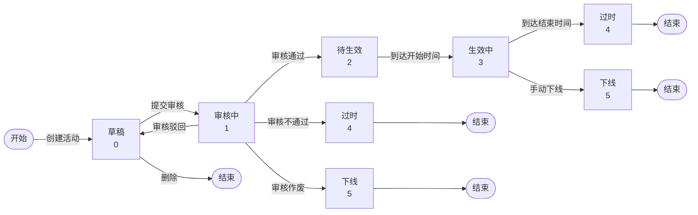
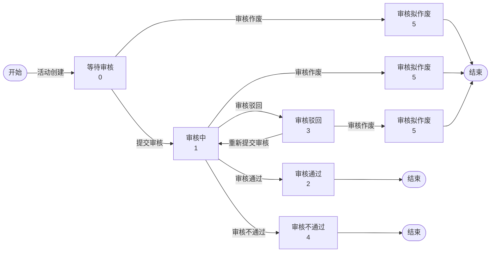
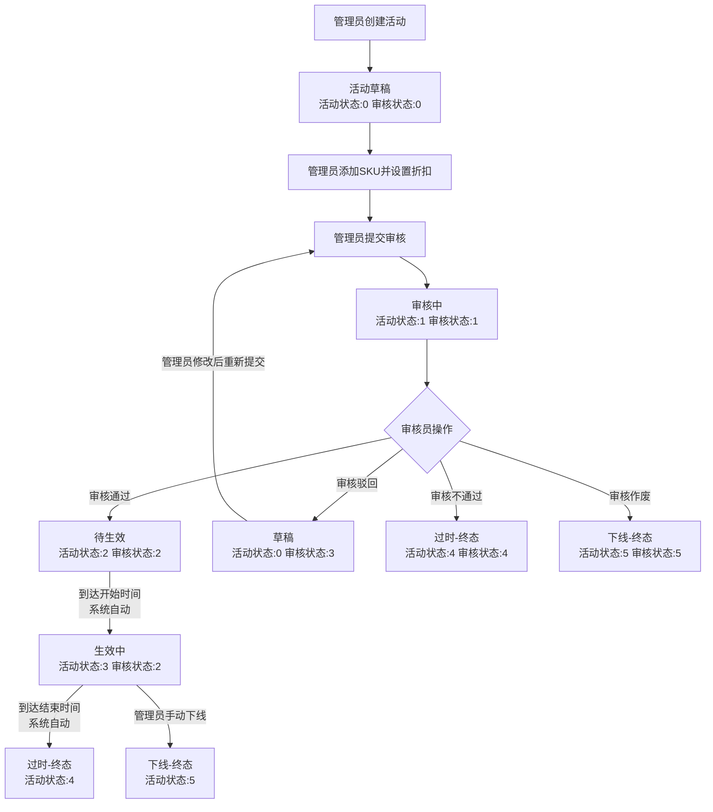

# 促销活动管理系统 —— 产品需求文档（PRD）

## 1. 文档概述

### 1.1 文档目的

本文档定义促销活动管理系统的完整产品需求，涵盖功能性需求与非功能性需求。

### 1.2 业务背景

在企业营销场景中，促销活动需要经过创建、审核、发布、执行、下线等完整流程。本系统旨在为促销活动提供全生命周期的标准化管理能力，支持活动创建、提交审核、审核流转、自动生效、自动过期、手动下线等核心业务环节。

### 1.3 用户角色

| 角色 | 编码 | 权限说明 |
|:---|:---|:---|
| **管理员** | 1 | 创建/编辑/删除活动、添加/移除关联SKU、提交审核、手动下线活动、管理SKU（增删改查） |
| **审核员** | 2 | 审核活动（通过/驳回/不通过/作废），查看活动详情与审核历史 |
| **外部客户** | - | 无需登录，只读查看活动详情与SKU折扣信息 |

---

## 2. 功能性需求

### 2.1 用户认证模块

| 功能编号 | 功能名称 | 需求描述 | 适用角色 |
|:---|:---|:---|:---|
| F-USER-01 | 用户注册 | 注册新用户，填写用户名、密码并选择角色 | 公开 |
| F-USER-02 | 用户登录 | 输入用户名和密码登录系统 | 公开 |
| F-USER-03 | 用户登出 | 退出登录，清除当前会话 | 管理员/审核员 |
| F-USER-04 | 查询用户信息 | 根据用户ID查询用户详情 | 管理员/审核员 |
| F-USER-05 | 更新用户信息 | 修改用户名、密码等信息 | 管理员/审核员 |

### 2.2 活动管理模块

| 功能编号 | 功能名称 | 需求描述 | 适用角色 |
|:---|:---|:---|:---|
| F-PROMO-01 | 创建活动 | 创建促销活动草稿，填写活动名称、开始时间、结束时间 | 管理员 |
| F-PROMO-02 | 编辑活动 | 修改活动名称、开始时间、结束时间。仅草稿状态可编辑 | 管理员 |
| F-PROMO-03 | 删除活动 | 删除草稿状态的活动 | 管理员 |
| F-PROMO-04 | 添加关联SKU | 为活动选择SKU并设置折扣（0.01~1.00） | 管理员 |
| F-PROMO-05 | 移除关联SKU | 从活动中移除已关联的SKU | 管理员 |
| F-PROMO-06 | 提交审核 | 将草稿活动提交至审核员审核 | 管理员 |
| F-PROMO-07 | 手动下线 | 将正在生效中的活动强制下线 | 管理员 |
| F-PROMO-08 | 活动列表查询 | 按活动名称、活动状态等条件分页查询活动列表 | 管理员 |
| F-PROMO-09 | 活动详情查询 | 查看活动完整信息（基本信息 + 关联SKU + 折扣 + 操作历史） | 管理员/审核员 |

### 2.3 审核流程模块

| 功能编号 | 功能名称 | 需求描述 | 适用角色 |
|:---|:---|:---|:---|
| F-AUD-01 | 审核通过 | 批准活动，活动进入待生效状态 | 审核员 |
| F-AUD-02 | 审核驳回 | 驳回活动并给出意见，管理员可修改后重新提交 | 审核员 |
| F-AUD-03 | 审核不通过 | 拒绝活动并给出意见，活动永久终止 | 审核员 |
| F-AUD-04 | 审核作废 | 对等待审核或已驳回状态的活动执行作废处理 | 审核员 |
| F-AUD-05 | 审核列表查询 | 分页查询审核任务列表，支持按审核状态筛选 | 审核员 |
| F-AUD-06 | 审核状态查询 | 查询指定活动的审核进度与审核记录 | 审核员 |

### 2.4 定时任务模块

| 功能编号 | 功能名称 | 需求描述 | 触发方式 |
|:---|:---|:---|:---|
| F-TASK-01 | 自动生效 | 到达活动开始时间时，自动将待生效活动变更为生效中 | 系统定时检查（每分钟） |
| F-TASK-02 | 自动过期 | 超过活动结束时间后，自动将生效中活动标记为已过期 | 系统定时检查（每分钟） |

### 2.5 SKU管理模块

| 功能编号 | 功能名称 | 需求描述 | 适用角色 |
|:---|:---|:---|:---|
| F-SKU-01 | 创建SKU | 创建新SKU，填写SKU名称和原价 | 管理员 |
| F-SKU-02 | 编辑SKU | 修改SKU的名称或原价 | 管理员 |
| F-SKU-03 | 删除SKU | 删除指定SKU | 管理员 |
| F-SKU-04 | SKU列表查询 | 分页查询所有SKU | 管理员 |
| F-SKU-05 | SKU详情查询 | 查询单个SKU的详细信息 | 管理员 |

### 2.6 外部客户查询模块

| 功能编号 | 功能名称 | 需求描述 | 适用角色 |
|:---|:---|:---|:---|
| F-CUST-01 | 查看活动详情 | 无需登录，查看活动基本信息与关联SKU折扣 | 外部客户 |
| F-CUST-02 | 查看SKU折扣 | 无需登录，查看单个SKU在活动中的折扣详情 | 外部客户 |
| F-CUST-03 | 查看活动SKU列表 | 无需登录，查看某活动下所有关联SKU | 外部客户 |

---

## 3. 业务规则

### 3.1 活动状态定义

| 状态码 | 状态名称 | 说明 | 是否终态 |
|:---|:---|:---|:---|
| 0 | 草稿 | 活动创建后的初始状态，可编辑、提交或删除 | 否 |
| 1 | 审核中 | 已提交审核，等待审核员处理 | 否 |
| 2 | 待生效 | 审核已通过，等待到达活动开始时间 | 否 |
| 3 | 生效中 | 活动正在执行，对外提供折扣 | 否 |
| 4 | 过时 | 活动已自然过期 | 是 |
| 5 | 下线 | 被管理员手动强制下线 | 是 |

### 3.2 审核状态定义

| 状态码 | 状态名称 | 说明 | 是否终态 |
|:---|:---|:---|:---|
| 0 | 等待审核 | 活动创建后等待管理员提交 | 否 |
| 1 | 审核中 | 审核员正在处理 | 否 |
| 2 | 审核通过 | 审核通过，活动可进入生效周期 | 是 |
| 3 | 审核驳回 | 被驳回，管理员可修改后重新提交 | 否 |
| 4 | 审核不通过 | 审核不通过，活动永久终止 | 是 |
| 5 | 审核拟作废 | 审核被作废，活动终止 | 是 |

### 3.3 活动状态流转



### 3.4 审核状态流转



### 3.5 完整活动生命周期流程



### 3.6 操作权限矩阵

| 操作 | 活动状态 | 审核状态 | 角色 |
|:---|:---:|:---:|:---|
| 编辑活动 | 草稿(0) | 等待审核(0) 或 驳回(3) | 管理员 |
| 删除活动 | 草稿(0) | 任意 | 管理员 |
| 提交审核 | 草稿(0) | 等待审核(0) 或 驳回(3) | 管理员 |
| 添加/移除SKU | 草稿(0) | 任意 | 管理员 |
| 手动下线 | 生效中(3) | 审核通过(2) | 管理员 |
| 审核通过 | 审核中(1) | 审核中(1) | 审核员 |
| 审核驳回 | 审核中(1) | 审核中(1) | 审核员 |
| 审核不通过 | 审核中(1) | 审核中(1) | 审核员 |
| 审核作废 | 草稿(0) 或 审核中(1) | 等待审核(0) 或 驳回(3) | 审核员 |

### 3.7 业务约束

1. 已进入终态的活动（过时/下线）不可再进行任何操作
2. 已进入终态的审核（通过/不通过/拟作废）不可再变更
3. 审核未通过的活动不能进入生效周期
4. 活动开始时间必须早于结束时间
5. 活动名称长度 1~100 个字符
6. SKU折扣必须在 0.01 ~ 1.00 之间
7. 每个操作必须记录操作人和操作时间

---

## 4. 非功能性需求

### 4.1 可用性

| 编号 | 需求描述 |
|:---|:---|
| N-US-01 | 系统提供Web管理界面，管理员和审核员可通过浏览器完成所有操作 |
| N-US-02 | 操作按钮根据当前活动/审核状态动态显示，非可用操作应隐藏或置灰 |
| N-US-03 | 活动状态和审核状态以可视化标签展示，不同状态使用不同颜色区分 |
| N-US-04 | 活动操作历史以时间线形式展示，按时间倒序排列 |
| N-US-05 | 表单提交前进行前端校验，必填项、格式错误等给出即时提示 |

### 4.2 性能

| 编号 | 需求描述 |
|:---|:---|
| N-PF-01 | 页面首次加载时间不超过3秒 |
| N-PF-02 | 常规API请求响应时间不超过500ms |
| N-PF-03 | 系统支持同时50个用户并发操作 |
| N-PF-04 | 列表查询支持分页，每页默认20条记录 |

### 4.3 安全性

| 编号 | 需求描述 |
|:---|:---|
| N-SE-01 | 用户必须登录后才能访问管理端功能，未登录自动跳转登录页 |
| N-SE-02 | 管理员和审核员只能访问各自权限范围内的页面和功能 |
| N-SE-03 | 用户密码必须加密存储，不可明文保存 |
| N-SE-04 | 外部客户查询接口无需认证，但仅提供只读能力 |

### 4.4 可修改性

| 编号 | 需求描述 |
|:---|:---|
| N-MO-01 | 新增活动状态时，改动范围应控制在状态配置层面，不影响核心业务逻辑 |
| N-MO-02 | 新增审核节点或调整审核流程时，改动范围应控制在审核模块内 |
| N-MO-03 | SKU模块与活动模块应保持独立，互不影响 |
| N-MO-04 | 新增用户角色时，应在不改动核心业务逻辑的前提下配置权限 |

### 4.5 可靠性

| 编号 | 需求描述 |
|:---|:---|
| N-RE-01 | 所有操作应记录日志（操作人、操作时间、操作内容），支持事后审计 |
| N-RE-02 | 活动状态与审核状态在任意时刻应保持一致，不允许出现非法状态组合 |
| N-RE-03 | 定时任务处理单个活动失败时不应影响其他活动的处理 |
| N-RE-04 | 操作失败时应给出明确的错误提示，不应出现静默失败 |

---

## 5. 数据需求

### 5.1 用户信息

| 字段 | 说明 | 必填 |
|:---|:---|:---|
| 用户ID | 系统生成唯一标识 | 是 |
| 用户名 | 登录用，全局唯一 | 是 |
| 密码 | 加密存储 | 是 |
| 角色 | 1=管理员，2=审核员 | 是 |
| 注册时间 | 账号创建时间 | 是 |
| 更新时间 | 最近修改时间 | 否 |

### 5.2 活动信息

| 字段 | 说明 | 必填 |
|:---|:---|:---|
| 活动ID | 系统生成唯一标识 | 是 |
| 活动名称 | 1~100字符 | 是 |
| 开始时间 | 活动生效开始时间 | 是 |
| 结束时间 | 活动生效结束时间，必须晚于开始时间 | 是 |
| 活动状态 | 当前活动状态码（0~5） | 是 |
| 审核状态 | 当前审核状态码（0~5） | 是 |
| 创建人 | 创建该活动的管理员ID | 是 |
| 最近操作人 | 最近一次操作的管理员ID | 否 |
| 创建时间 | 活动创建时间 | 是 |
| 更新时间 | 最近修改时间 | 否 |

### 5.3 活动关联SKU

| 字段 | 说明 | 必填 |
|:---|:---|:---|
| 记录ID | 系统生成唯一标识 | 是 |
| 活动ID | 关联的活动 | 是 |
| SKU ID | 关联的SKU | 是 |
| 折扣 | 0.01~1.00，如0.80表示8折 | 是 |

### 5.4 SKU信息

| 字段 | 说明 | 必填 |
|:---|:---|:---|
| SKU ID | 系统生成唯一标识 | 是 |
| SKU名称 | 商品名称 | 是 |
| 原价 | 商品原始价格 | 是 |

### 5.5 审核记录

| 字段 | 说明 | 必填 |
|:---|:---|:---|
| 审核ID | 系统生成唯一标识 | 是 |
| 活动ID | 关联的活动 | 是 |
| 审核状态 | 当前审核状态码（0~5） | 是 |
| 提交审核时间 | 管理员提交时间 | 否 |
| 审核完成时间 | 审核员完成时间 | 否 |
| 审核员ID | 执行审核的审核员 | 否 |
| 审核意见 | 审核员填写意见 | 否 |
| 创建时间 | 记录创建时间 | 是 |
| 更新时间 | 最近修改时间 | 否 |

### 5.6 操作日志

| 字段 | 说明 | 必填 |
|:---|:---|:---|
| 日志ID | 系统生成唯一标识 | 是 |
| 操作类型 | 操作类型编码 | 是 |
| 活动ID | 关联的活动 | 是 |
| 操作前活动状态 | 操作前的活动状态码 | 否 |
| 操作前审核状态 | 操作前的审核状态码 | 否 |
| 操作人 | 执行操作的用户ID | 否 |
| 操作时间 | 操作发生时间 | 是 |
| 操作参数 | 附加参数（JSON格式） | 否 |

---

## 6. 接口需求

### 6.1 用户认证接口

| 路径 | 方法 | 功能 |
|:---|:---|:---|
| `/api/user/login` | POST | 用户登录 |
| `/api/user/logout` | POST | 用户登出 |
| `/api/user/register` | POST | 用户注册 |
| `/api/user/{id}` | GET | 查询用户详情 |
| `/api/user/update/{id}` | PUT | 更新用户信息 |

### 6.2 活动管理接口

| 路径 | 方法 | 功能 |
|:---|:---|:---|
| `/api/promotion/create` | POST | 创建活动 |
| `/api/promotion/update/{id}` | PUT | 更新活动信息 |
| `/api/promotion/delete/{id}` | DELETE | 删除活动 |
| `/api/promotion/submit-audit/{id}` | POST | 提交审核 |
| `/api/promotion/offline/{id}` | POST | 手动下线 |
| `/api/promotion/list` | GET | 活动列表查询 |
| `/api/promotion/{id}` | GET | 活动详情查询 |

### 6.3 审核接口

| 路径 | 方法 | 功能 |
|:---|:---|:---|
| `/api/audit/pass/{promotionId}` | POST | 审核通过 |
| `/api/audit/reject/{promotionId}` | POST | 审核驳回 |
| `/api/audit/notpass/{promotionId}` | POST | 审核不通过 |
| `/api/audit/cancel/{promotionId}` | POST | 审核作废 |
| `/api/audit/status/{promotionId}` | GET | 查询审核状态 |

### 6.4 SKU管理接口

| 路径 | 方法 | 功能 |
|:---|:---|:---|
| `/api/sku/create` | POST | 创建SKU |
| `/api/sku/update/{id}` | PUT | 更新SKU |
| `/api/sku/delete/{id}` | DELETE | 删除SKU |
| `/api/sku/{id}` | GET | 查询SKU详情 |
| `/api/sku/list` | GET | 查询SKU列表 |

### 6.5 外部客户接口

| 路径 | 方法 | 功能 |
|:---|:---|:---|
| `/api/customer/promotion/{id}` | GET | 查看活动详情 |
| `/api/customer/sku/{id}` | GET | 查看SKU折扣 |
| `/api/customer/sku` | GET | 查看活动所有SKU |

### 6.6 统一响应格式

```json
{
  "code": 200,
  "message": "操作成功",
  "data": { }
}
```

| code | 含义 |
|:---|:---|
| 200 | 成功 |
| 400 | 请求参数错误 |
| 401 | 未登录或凭证过期 |
| 403 | 无权限 |
| 404 | 资源不存在 |
| 500 | 服务器内部错误 |

---

## 7. 附录：术语表

| 术语 | 说明 |
|:---|:---|
| 促销活动（Promotion） | 包含时间范围、关联SKU和折扣规则的营销活动 |
| SKU | 库存单位（Stock Keeping Unit），代表一个商品 |
| 折扣 | 对原价的打折比例，如0.80表示以原价80%销售 |
| 终态 | 不可再变更的最终状态 |
| 草稿 | 活动创建后、提交审核前的可编辑状态 |
