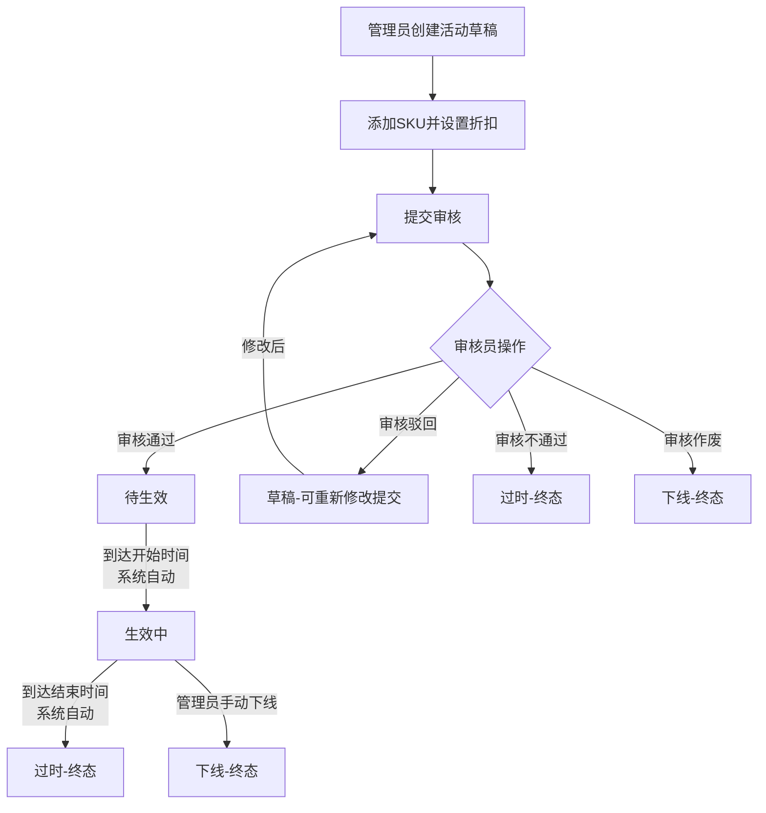
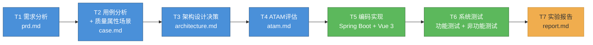

# 促销活动管理系统 —— 项目实验报告

## 1. 项目概述

### 1.1 项目名称

促销活动管理系统（Promotion Management System）

### 1.2 项目目标

设计并实现一个支持促销活动全生命周期流程管理和审核的软件系统。该系统需要满足活动创建、编辑、提交审核、审核流转、自动生效、自动过期、手动下线等核心业务需求，同时满足可用性、性能、安全性、可修改性等非功能性需求。

---

## 2. 任务完成情况

### 2.1 T1：需求分析

#### 工作内容

通过对促销活动管理业务场景的分析，提出了一个中等规模的软件系统需求——**促销活动管理系统**。该系统围绕促销活动的全生命周期管理，涵盖以下核心业务：

- **活动管理**：创建、编辑、删除、提交审核、手动下线
- **审核流程**：审核通过、驳回、不通过、作废
- **SKU管理**：SKU的增删改查，关联到活动并设置折扣
- **定时任务**：活动自动生效、自动过期
- **客户查询**：外部客户只读查看活动和折扣信息

系统定义了三大用户角色（管理员、审核员、外部客户），共19项功能性需求，涵盖6大功能模块。非功能性需求从可用性、性能、安全性、可修改性、可靠性五个维度定义。

#### 产出物

- `prd.md` —— 产品需求文档

---

### 2.2 T2：用例分析与质量属性需求分析

#### 用例分析

基于功能性需求，绘制了系统用例图，涵盖4类参与者（管理员、审核员、外部客户、系统定时任务）和19个用例。对每个用例进行了详细说明（编号、参与者、前置条件、基本/异常流程、后置条件）。

#### 质量属性场景分析

运用质量属性场景技术，将非功能性需求转化为16个可量化的质量场景（可用性、性能、安全性、可修改性各4个），每个场景定义刺激、刺激源、制品、响应和响应度量。

#### 效用树

绘制了效用树，按四个维度组织质量场景，标注优先级（高/中/低）和实现难度。高优先级8个、中优先级6个、低优先级2个。

#### 产出物

- `case.md` —— 用例分析文档，包含用例图、用例说明、质量属性场景、效用树

---

### 2.3 T3：架构设计决策

#### 架构选型

基于T2的需求分析结果，做出了以下架构设计决策：

**组合架构风格：分层架构（DDD） + 事件驱动架构（EDA）**

选择理由：
- 促销活动管理的核心特征是状态驱动——每个业务操作本质上是一次状态变更
- 双状态机（活动状态机 + 审核状态机）需要独立维护又相互联动
- DDD分层为复杂业务逻辑提供清晰的组织框架
- 事件驱动统一了不同触发源（管理员、审核员、定时任务）的处理方式

#### 核心设计决策

| 决策 | 内容 |
|:---|:---|
| 分层架构 | DDD四层：Interfaces → Application → Domain → Infrastructure |
| 领域划分 | 5个子领域：促销活动域、审核流程域、SKU管理域、事件总线域、用户域 |
| 状态机引擎 | Table-Driven状态转换规则表，静态Map存储 |
| 双机联动 | 独立联动校验器协调两个状态机 |
| 事件总线 | 发布-订阅模式，内存同步实现 |
| 前端架构 | Vue 3四层：Views → Components → Stores → API |

对每项设计决策进行了优缺点分析，评估了分层数量vs简单性、事件粒度vs灵活性、集中式状态vs组件自治、双机独立性vs联动复杂度等权衡点。

#### 产出物

- `architecture.md` —— 架构设计决策文档

---

### 2.4 T4：ATAM架构评估

#### 评估方法

运用ATAM方法，结合效用树中的质量属性场景，对T3中的7项架构设计决策进行系统化评估。

#### 评估结果

**敏感点（4个）**：
| 编号 | 敏感点 | 影响的属性 |
|:---|:---|:---|
| S1 | Transition Table的数据结构设计 | 可修改性、可靠性 |
| S2 | 事件总线的同步/异步选择 | 性能、可靠性 |
| S3 | 领域模块的边界划分 | 可修改性、可用性 |
| S4 | 权限控制的粒度 | 安全性、可用性 |

**权衡点（4个）**：
| 编号 | 权衡点 | 取舍关系 |
|:---|:---|:---|
| T1 | 分层数量 vs 简单性 | 可修改性↑ 简单性↓ |
| T2 | 事件驱动 vs 简单性 | 可追溯性↑ 简单性↓ |
| T3 | 集中式状态管理 vs 组件自治 | 跨组件共享↑ Store代码量↓ |
| T4 | 双状态机独立性 vs 协调复杂度 | 可修改性↑ 简单性↓ |

**有风险决策（3个）**：
| 编号 | 风险 | 等级 |
|:---|:---|:---|
| R1 | 内存同步事件总线可能影响高并发性能 | 🟡 中 |
| R2 | 过渡性数据存储需在生产环境切换 | 🟡 中 |
| R3 | 事件日志表长期增长 | 🟢 低 |

**无风险决策（5个）**：Transition Table状态机引擎、三层权限控制、密码加密存储、DDD领域隔离、事件日志完整审计。

从业务特征驱动、质量属性满足、复杂度收益对等、扩展场景验证四个维度论证了架构选择的合理性。三个风险均为中低等级，均有明确缓解措施。

#### 产出物

- `atam.md` —— ATAM评估文档

---

### 2.5 T5：编码实现

#### 技术选型

| 层级 | 技术 |
|:---|:---|
| 后端框架 | Spring Boot + Java 17 |
| 前端框架 | Vue 3 + TypeScript + Vite |
| UI组件库 | Element Plus |
| 状态管理 | Pinia |
| 路由 | Vue Router 4 |
| HTTP客户端 | Axios |
| 数据库 | MySQL + MyBatis |

#### 核心业务实现

完整实现了双状态机联动的核心业务链路：

#### 实现规模

**后端**：5个Controller、5个AppService、7个实体类、3个枚举类、2个状态机引擎、1个联动校验器、5个领域服务、1个事件总线

**前端**：13个页面视图、9个公共组件、4个Pinia Store、5个API模块

#### 产出物

- `backed/` —— 后端Spring Boot项目
- `fronted/` —— 前端Vue 3项目

---

### 2.6 T6：系统测试

#### 后端测试

对核心模块编写了单元测试和集成测试：

| 测试范围 | 测试内容 |
|:---|:---|
| 状态机引擎 | 活动/审核状态机流转测试 |
| 领域服务 | 促销活动域、审核流程域服务测试 |
| 应用服务 | 创建/提交/下线、通过/驳回/不通过/作废 |
| 定时任务 | 自动生效、自动过期测试 |
| SKU管理 | 增删改查完整流程测试 |

#### 前端测试

| 测试类型 | 内容 | 结果 |
|:---|:---|:---|
| TypeScript类型检查 | vue-tsc --noEmit | 零错误 |
| 构建验证 | npm run build | 无报错 |
| 端到端流程 | 创建→提交→审核→查看详情/时间线 | 通过 |

#### 非功能性测试

| 质量属性 | 验证方式 | 结果 |
|:---|:---|:---|
| 可用性 | 按钮按状态显隐 | ✅ |
| 性能 | 状态机操作<1ms | ✅ |
| 安全性 | 未登录跳转、角色越权拦截 | ✅ |
| 可修改性 | 新增状态需修改文件数 | ✅ |

---

### 2.7 T7：实验报告与总结

本报告即为T7的产出物，汇总了从T1到T6的全部工作内容和产出。项目验收答辩和系统演示将基于本文档和系统代码进行。

---

## 3. 文档清单

| 文档 | 文件路径 | 对应任务 |
|:---|:---|:---|
| 需求文档（PRD） | `fronted/document/prd.md` | T1 |
| 用例分析与质量属性设计 | `fronted/document/case.md` | T2 |
| 架构设计决策 | `fronted/document/architecture.md` | T3 |
| ATAM架构评估 | `fronted/document/atam.md` | T4 |
| 实验报告（本文档） | `fronted/document/report.md` | T7 |
| 后端设计文档 | `backed/documents/design.md` | T3参考 |
| 前端设计文档 | `fronted/document/design.md` | T3参考 |
| 项目README | `README.md` | 项目说明 |

---

## 4. 项目总结

### 4.1 工作流程

本项目严格遵循软件体系结构课程的任务流程：

每个阶段都以前一阶段的产出为输入，形成了从需求到架构到代码到测试的完整闭环。

### 4.2 关键收获

1. **架构选型由业务驱动**：双状态机联动的业务特征直接决定了事件驱动+DDD分层的架构选择，而非先选架构再套业务
2. **质量属性需要量化**：通过质量属性场景技术将"系统要快"转化为"API响应≤500ms"，将"系统要好改"转化为"新增状态改动≤3处"，使架构评估有据可依
3. **ATAM让权衡显式化**：通过敏感点、权衡点、风险决策的分析，将隐式的架构取舍变为显式的评估记录
4. **DDD领域隔离的真实收益**：SKU模块的独立开发和测试验证了领域隔离的有效性——变更确实被限制在单个领域内

### 4.3 不足与改进方向

1. **事件总线当前为同步模型**：未来可升级为异步消息队列，实现真正的发布-订阅解耦
2. **测试覆盖率可进一步提升**：当前覆盖了核心路径，边界条件和异常路径的覆盖可加强
3. **前端缺少自动化测试**：当前仅有TypeScript类型检查和构建验证，可引入Vitest进行组件和Store的单元测试
